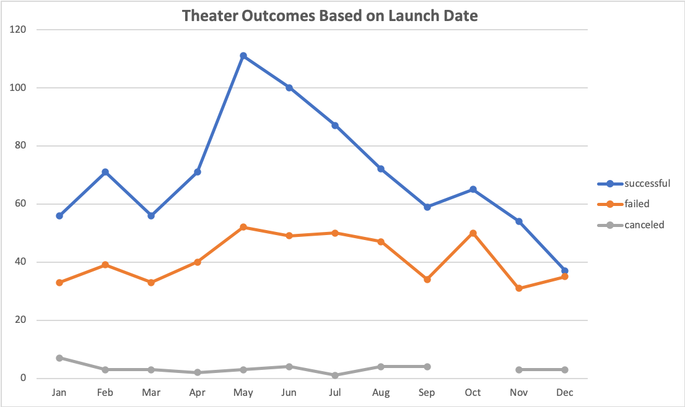
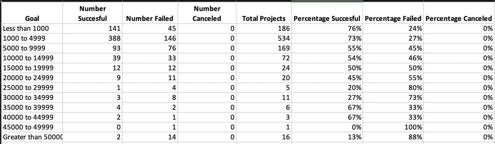
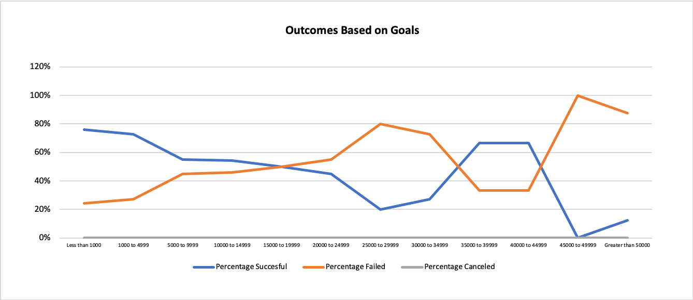
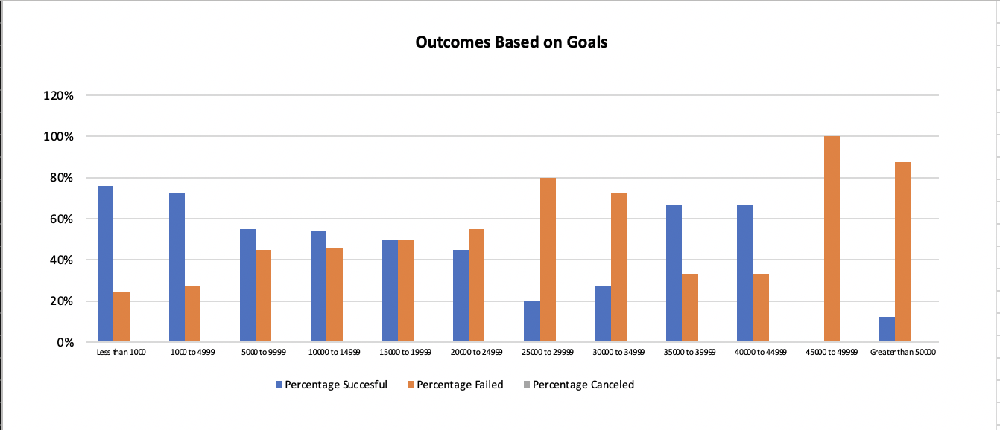

# Written Analysis of Results

## Overview of Project
Louise would like to compare the outcome of her play Fever to the various other campaigns that also took place, 
specifically concerning their launch dates as well as funding goals. This analysis will provide Louise with an analytical 
understanding of how Fever placed amongst other theatrical campaigns through the use of line charts, pivot tables, and a range of statistical analysis.  

### Purpose
The intended purpose of this analysis is to illustrate to Louis how the success and failures of campaigns vary to their launch date as well as funding goals. 
Therefore, Louise will be provided with descriptive, statistical, and visual data of the aforementioned campaigns based upon their goals and launch dates 
wherein a comparative analysis will demonstrate how the campaigns faired against their respective launch dates and goals. By employing pivot tables, 
statistical analysis, and line charts this analysis aims to better equip Louise in understanding the success and failures of the respective campaigns based 
on the variables mentioned previously as well as provide her with recommendations as to how she can plan her future campaigns.  

## Analysis and Challenges
## Analysis of Outcomes Based on Launch Date
After initially observing the data it became evident that the first step of the analysis was to sort the required data and breakdown its importance within 
what we were analyzing, of which included the campaign outcome column, launch date column, as well as the parent category to filter for theater productions. 
Following this, it was necessary to make the data more readable and therefore convert the date created conversion column to years using the YEAR () function,
to provide Louise with clear data. Moving forward, to create a visual representation of the data I condensed the outcomes, year, and the parent category into 
a pivot table, wherein I set the year and parent category columns as the filter, the columns as the outcome, the rows as date created conversion and set the 
values as count of outcomes. After creating the pivot table from these variables, I filtered the parent category to “theater”, the purpose of which was to 
summarize the large amount of data I was analyzing and discount the campaigns we weren’t necessary for the intended analysis. I also filtered the year's column 
to include all outcomes but the “live” campaigns, as these are not important in our current analysis. This is because they are still ongoing and have not 
concluded production, so it remains uncertain if they have succeeded or not. 

As we can see from the pivot table included above, the data appeared more concise and directed towards finding the relationship between the number of successful,
failed, or cancelled projects and there given launch date month. However, to better understand the was a relationship between the two data sets a line cart was
created to provide a visual representation of the findings; with the dependent variable (Theater Outcome) on the y-axis and the independent variable (Launch Date)
on the x-axis.

###Analysis of Outcomes Based on Goals
I conducted a similar analysis when examining the percentage of successful, failed, and cancelled plays based on their funding goal amount. 
However, because this statistical analysis relied on the derivation of the mean I created a chart to organize the data as opposed to a pivot table as we 
were not necessarily summarizing the data points that previously existed, rather we were creating new variables.
As can be observed from the chart above the COUNTIFS function was used to calculate the number of successful, failed, and cancelled plays based upon the range
of the goal amount which can be found in column A. The SUM function was then used in Column E to calculate the total amount of plays that were within the goal 
range to derive the percentage of successes, failures, and cancelations which can be found in columns F through H.

While analyzing the percentage of plays that were either successful, failed, or cancelled within the designated ranges it is easier for Louise to visualize 
the outcomes and compare them amongst other ranges. To provide Louise with a more visual understanding of the relationship I created a line graph that illustrated 
the percentage of successful, failed, and cancelled to the monetary goal range in which the plays maintained. As can be seen below the dependent 
variable (Outcome Percentage) is featured on the y-axis and the independent variable (Funding Goal) as the x-axis.

## Challenges and Difficulties Encountered
For the initial analysis of the Outcomes Based on Launch Date A challenge that I experienced momentarily was that I originally observed the data I had 
collected in the pivot table by year rather than a month, therefore when creating a line chart it became difficult to determine the relationship present
between the outcomes and launch dates as the data I had used was too general as can be observed in the line chart below.
_vs_Outcome.png)
By observing the results too generally we decrease the specificity that Louise desires in understanding the relationship between the Launch Date and the Outcome.
If we were to look at it by year we would have a good yet general idea of when the theater was most successful, however, we fail to provide an accurate 
analysis as the year (2015) that it appears theater was most successful is the same year that it had its most failures. To correct this I grouped the row 
labels to show the months as opposed to the years so that Louise could gain a better understanding of when the theater was truly most successful as the data 
from past years doesn’t allow her to plan for the future; if she were to know the months specifically she could gain a more accurate representation of what 
months could be most successful to launch campaigns in the future.

## Results
### Conclusions Drawn From the Theater Outcomes Based on Launch Date
After analyzing the data derived from the Outcomes-based on Launch Date data set two conclusions can be drawn; firstly, theater campaigns were most 
successful between May and June. When observing the pivot table this also becomes evident as the number of successful campaigns in May (111) nearly 
doubled from that in January (56). Therefore, based upon the given data a positive correlation is observed between that of the campaigns that failed and 
those that were successful, as the increase in successful campaigns has also led to an increase in campaign failures. Looking at the Theater Outcomes Based 
on Launch Date figure we can also determine that there is no correlation between the successful and failed campaigns with the cancelled campaigns. 
When analyzing the data provided for cancelled campaigns the only conclusion that can be met is that the maximum of campaigns cancelled occurred in January
with 7 plays cancelled, and the minimum occurred in October wherein no campaigns were cancelled. We can observe here specifically that there is no correlation 
between this variable and the successful/failed variables as October did not experience any significant increases or decreases concerning the absence of 
cancelled campaigns. Secondly, these campaigns were least successful in December wherein we observe the least number of successful projects which can be
further supported by the mean in which indicates that 49.3% of campaigns were successful during this month and 46.7% failed.

### Conclusions Drawn From The Outcomes Based on Goals 
From the Outcomes Based on Goals data, it can be concluded that the percentage of successful, failed, and cancelled plays based upon the range of
funding goal maintains considerable variability and there is a negative correlation. More specifically, while we can observe from the line chart that at 
the funding goal of less than $1000 76% of plays were successful, 24% had failed. Furthermore, if we were to look at the funding goal range of $2500 to $2999, 
we would observe a similar pattern as 20% of plays succeeded and the remaining 80% failed. From this, we can conclude when there is an increase in the percentage
of successful plays there is a subsequent decrease in the amount of failed campaigns that differ from the Theater Outcomes Based on Launch Date dataset. 
Besides, the r-squared value captured by the line of regression indicates a value of 0.4291 which indicates that the data does not accurately the variability
around the mean. Therefore, it can be concluded that there is no correlation present between the outcome and the funding goal.

### Limitations 
I have found that one of the most significant limitations of the dataset is the failure to account for the total duration of the campaign, this variable 
is important to consider for two reasons. Firstly, for Theater Outcomes Based on Launch Date we can see the number of successful, failed, or cancelled 
campaigns based only upon when they began- it fails to consider the duration of the campaign, and how long it took for it to meet the intended funding goals 
and thus be categorized as successful or failed. If Louise desires an accurate representation of how her play Fever faired against other projects, it must be 
taken into account how long these projects ran to analyze the outcomes of each campaign appropriately. Discounting how long the campaigns ran for means 
that Fever which ran for approximately a month could not be compared against a play such as The Last Encore Musical that ran for two months as other variables
such as more time to reach the funding goal, could skew the data so that it’s not an accurate comparison. This limitation can be addressed by creating a 
new column in the data set that indicates the total duration of the play and compares that data to the outcome in addition to the launch date dataset.
A second limitation of the dataset is twofold; the Outcomes Based on Goals dataset did not account for the variation in location- because of this, there 
was no standard currency from which we could accurately base the rate of successes, failures, and cancellations. Furthermore, because differing currencies
are accompanied by different valuations in other countries, we cannot gain an accurate depiction that those who succeeded were truly within the monetary
ranges prescribed by the dataset. For example, if a play were to reach its funding goal in CAD it could be accounted for in a different monetary range if 
converted to USD. To solve this problem a standardized currency or country/location must be used to ensure that the data being analyzed is constant.

### Recommendations 
An alternate way of visualizing the dataset for Outcomes Based on Goals would be to create a pivot chart including the specific monetary value of the funding 
goal as well as the outcomes of those campaigns that succeeded, failed, and were cancelled and in addition to the existing line chart, plot the raw data in 
a scatter plot as opposed to employing a range system. Therefore, if Louise wanted to analyze the specified outcomes within a range, she would be able to 
also visualize the relationship in a more precise way. For example, Fever’s funding goal was $2885.00, there are a total of five projects that had a funding 
goal within the range of more than or equal to $2500 and less than or equal to $2999.Say she was curious to see the exact amounts of these projects and their
subsequent outcomes, she would be able to reference the scatter plot which indicates the exact goal and outcome to provide a better comparison to fever within 
its intended goal range. Additionally, a bar graph also offers a similar way of visualizing the dataset we have created and better illustrates the more 
significant differences in data as opposed to the line chart which is useful in showing the smaller changes over time.

Also, it would be beneficial to create a separate line chart and pivot table for Outcomes Based on Date Ended and provide a comparative analysis between 
the two graphs to see if there were any correlations between the duration of the campaigns and their outcomes as opposed to just focusing on the launch 
date apart from the rest of the data.
